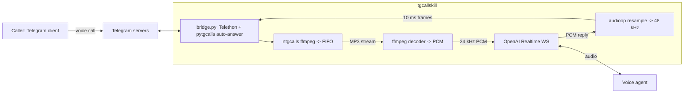

<div align="center">


# tgcallskill

**Auto-answer Telegram private calls with an OpenAI Realtime voice agent.**

Your Telegram phone number rings, an AI picks up, hears the caller, and speaks back in a realtime two-way voice conversation.

[](https://www.python.org/)
[](https://github.com/astral-sh/uv)
[](https://core.telegram.org/mtproto)
[](https://platform.openai.com/docs/guides/realtime)
[](#license)

[**Setup wizard ->**](https://tele.lintware.com) &nbsp;·&nbsp; [**Live demo**](#demo) &nbsp;·&nbsp; [**Architecture**](#architecture) &nbsp;·&nbsp; [**Configuration**](#configuration)

</div>

---

## What It Does

- Signs in to a Telegram account via MTProto using a Telethon session.
- Auto-accepts incoming private voice calls to that account.
- Bridges live call audio to OpenAI Realtime so the agent can both hear the caller and speak back.
- Defaults to `gpt-realtime-2` with the `alloy` voice.
- Can be adapted to another realtime voice-to-voice model if the user names one and a matching provider adapter is configured.

> Tested end-to-end. Caller dials your Telegram number, an AI receptionist answers and holds a natural conversation.

---

## Quickstart

> **Platform support:** macOS, Linux, and Windows via WSL2. The runtime relies on Unix named pipes (`os.mkfifo`) and `/tmp` for inbound audio plumbing, so Windows users must run inside WSL2.

### 1. Install System Deps

| OS | One-liner |
|----|-----------|
| macOS | `brew install ffmpeg uv python@3.12` |
| Linux, Debian/Ubuntu | `sudo apt update && sudo apt install -y ffmpeg python3.12 && curl -LsSf https://astral.sh/uv/install.sh | sh` |
| Linux, Arch | `sudo pacman -S ffmpeg python uv` |
| Windows | In an admin PowerShell: `wsl --install -d Ubuntu`, reboot, open Ubuntu, then run the Debian line above. |

### 2. Get The Code And Run

```bash
git clone https://github.com/vasanthsreeram/tgcallskill.git
cd tgcallskill
uv sync
cp .env.example .env       # fill in Telegram + OpenAI credentials
uv run python login.py     # one-time: enter Telegram OTP and 2FA if set
uv run python bridge.py    # leave running; it auto-answers incoming calls
```

Or use the setup wizard at <https://tele.lintware.com>. It asks for Telegram credentials and one realtime voice-to-voice model choice. OpenAI Realtime is the default.

---

## Demo

```text
2026-05-17 16:17:28 INFO  INCOMING_CALL user=495589406
2026-05-17 16:17:28 INFO  provider=openai opened (in=24000 out=24000)
2026-05-17 16:17:29 INFO  AGENT: Hello! How can I help you today?
2026-05-17 16:17:29 INFO  ffmpeg decoder spawned pid=91376
2026-05-17 16:17:29 INFO  ntgcalls.record() started -> /tmp/peer_495589406_1779005849.mp3
2026-05-17 16:17:29 INFO  call fully armed (out + in)
2026-05-17 16:17:34 INFO  USER: Hi, are you able to hear me?
2026-05-17 16:17:35 INFO  AGENT: Yes, I can hear you perfectly. How can I help?
2026-05-17 16:17:46 INFO  DISCARDED_CALL user=495589406
```

---

## Configuration

All knobs live in `.env`. See [`.env.example`](.env.example) for the full set.

```env
# Telegram
TG_API_ID=22053552
TG_API_HASH=ee9c...
TG_PHONE=+14155552671
TG_SESSION=telecall

# Voice agent
VOICE_PROVIDER=openai
VOICE_SYSTEM_PROMPT="You are answering an incoming phone call. Be friendly, concise, and useful."
INITIAL_GREETING_ENABLED=true
INITIAL_GREETING_TEMPLATE="Hi! My name is {name}. I'm here to assist you."

# OpenAI Realtime
OPENAI_API_KEY=sk-...
OPENAI_REALTIME_MODEL=gpt-realtime-2
OPENAI_REALTIME_VOICE=alloy
OPENAI_REALTIME_SPEED=1.08
```

When a private call is accepted, the OpenAI Realtime provider immediately asks the agent to say the initial greeting before the caller speaks. `{name}` is filled from the Telegram account name, or `AGENT_DISPLAY_NAME` if you set one.

To use another realtime voice-to-voice model, name the model/provider during setup. The agent will collect the right credentials and configure or add the matching provider adapter.

---

## Architecture



### Audio Plumbing

| Direction | Path |
|-----------|------|
| Caller to AI | `pytgcalls.record(RecordStream(audio="/tmp/peer_<id>.mp3"))` -> MP3 written to a FIFO -> child `ffmpeg` decodes -> PCM at provider rate -> `provider.send_audio(...)` |
| AI to caller | provider websocket emits PCM at `provider.output_rate` -> `audioop.ratecv` upsamples to 48 kHz -> 10 ms / 960 B chunks -> `pytgcalls.send_frame(..., Device.MICROPHONE, chunk)` |

The `on_frames` callback is not used because current ntgcalls does not deliver private-call peer PCM through it. The FIFO plus ffmpeg path is the working route.

---

## Project Layout

```text
.
├── bridge.py                       # runtime
├── login.py                        # one-time interactive Telethon auth
├── providers/
│   ├── base.py                     # provider protocol
│   └── openai_realtime.py          # default voice-to-voice adapter
├── skill/tgcallskill/SKILL.md      # skill metadata and setup flow
├── site/public/index.html          # static setup wizard
├── docs/banner.svg
└── .env.example
```

The codebase may include additional provider adapters. OpenAI Realtime remains the documented default; other realtime voice-to-voice models are configured only when the user asks for one.

---

## Troubleshooting

<details>
<summary><strong>Caller stuck on "exchanging encryption keys"</strong></summary>

You accepted MTProto signaling but never started the media plane. Make sure `pytgcalls.play(...)` runs inside the `INCOMING_CALL` handler.
</details>

<details>
<summary><strong>The agent cannot hear the caller</strong></summary>

Make sure `pytgcalls.record(RecordStream(audio="/tmp/...mp3"))` runs after `play(...)`. The `on_frames` callback does not fire for private-call peer audio; the FIFO plus ffmpeg route is the workaround used here.
</details>

<details>
<summary><strong><code>Future attached to a different loop</code></strong></summary>

`PyTgCalls(tele)` captures the running asyncio loop on construction. Build it inside `async def main()` rather than at module top level.
</details>

<details>
<summary><strong>Choppy outbound voice</strong></summary>

Use fixed frame sizes and cadence. Standardize on 10 ms = 960 B at 48 kHz mono and tick the player every 10 ms.
</details>

<details>
<summary><strong>OpenAI Realtime 401 or 4xx</strong></summary>

Check the bearer token, current Realtime API connection requirements, model name, and voice name.
</details>

---

## Privacy

- The hosted wizard at <https://tele.lintware.com> is a fully static page. Credentials never leave your browser.
- Your Telegram session file (`telecall.session`) stays on the machine running `bridge.py`. Do not commit it.
- The bridge stores no audio by default. Recording paths in the code are diagnostic only and are git-ignored.

---

## License

[MIT](LICENSE) - use at your own risk. Be courteous: tell callers when they are talking to an AI.

---

<div align="center">
  <sub>Built with <a href="https://core.telegram.org/mtproto">MTProto</a>, <a href="https://github.com/pytgcalls/pytgcalls">pytgcalls</a>, <a href="https://docs.telethon.dev">Telethon</a>, and a few well-placed FIFOs.</sub>
</div>
